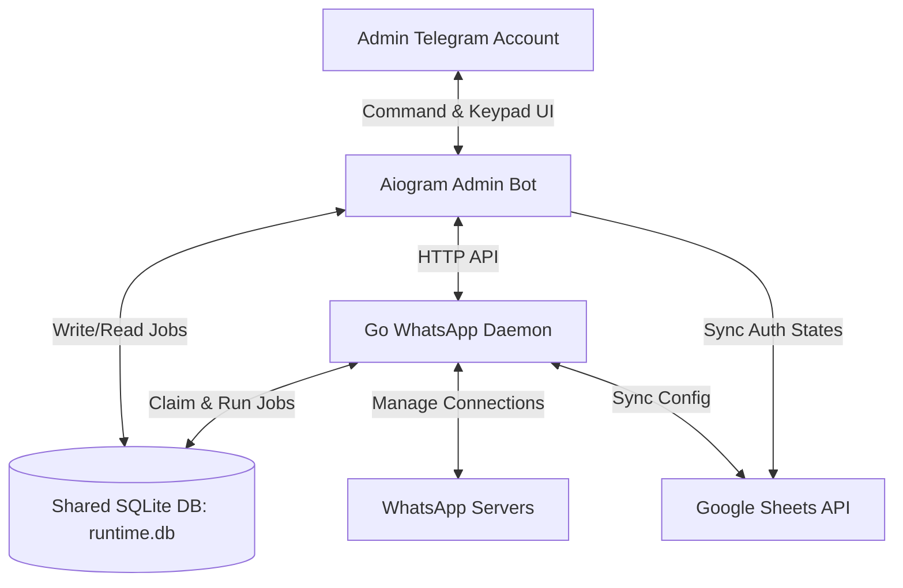

# 🟢 WhatsApp Account Warmup Manager (Go & Python)

An enterprise-grade WhatsApp automation solution designed to warm up multiple WhatsApp accounts simultaneously by simulating natural, human-like chat dialogue behaviors. It consists of a **Golang WhatsApp service daemon** for core message dispatching and scheduling, paired with a **Python Telegram Bot admin panel** for centralized administration.

---

## 🌟 Key Features

*   **Dual-Service Architecture** – Built using **Golang** (for low-latency WhatsApp socket connections and scheduling) and **Python/Aiogram 3.x** (for rapid development of a premium Telegram Bot admin UI).
*   **Real-time QR Code Authentication** – Authorize new WhatsApp accounts directly through the Telegram bot. The Python bot listens to a streaming NDJSON endpoint from the Go backend, dynamically renders the login QR code as a PNG, and updates it in the chat for you to scan.
*   **Robust Go Engine (`whatsmeow`)** – Implements the modern `whatsmeow` library for connection stability and multi-device session management. 
*   **Dual-Path Warmup Planning**:
    *   *Automated Sheets-Based:* Automatically synchronizes list of accounts and scheduling patterns from Google Sheets, generating dialog plans based on target dates and counts.
    *   *Manual Chain Creator:* Create custom chat chains step-by-step using inline buttons inside the Telegram Bot admin panel.
*   **Human-Like Chat Simulation** – Alternates sender/receiver roles, uses randomized delay ranges (e.g. 40-60 minutes), respects customizable active hour windows, and selects phrase variations from a `data/sentences_list.json` database.
*   **Shared SQLite Runtime State** – The services communicate instantly by mounting a shared directory and accessing the same SQLite database (`sessions/runtime.db`).
*   **Dockerized Deployment** – Instantly deployable using a multi-service `docker-compose.yaml`.

---

## 🛠️ Architecture & Tech Stack



### Golang WhatsApp Engine (`wa-user-bot`):
*   **WhatsApp Library**: `whatsmeow` (Go library for the WhatsApp Web Multi-Device API)
*   **Database**: `go-sqlite3`
*   **Google Sheets**: `google.golang.org/api/sheets/v4`
*   **API Framework**: Native HTTP API server

### Python Admin Bot (`admin-tg-bot`):
*   **Telegram Bot API**: `aiogram` (v3.x)
*   **Database**: `aiosqlite`
*   **Google Sheets**: `gspread` & `google-auth`
*   **QR Rendering**: `qrcode`

---

## 🔐 Admin Access & Security Model

To ensure security, only authorized users can access the bot control panel and manage active WhatsApp accounts.

### Developer/Owner Configuration
Access is configured via the `.env` configuration file. During deployment, define the primary owner's Telegram ID in the `ADMINS` environment variable.

### Multi-Admin Configuration
To grant access to other administrators or clients:
1. Obtain the Telegram User ID of the new admin (e.g., via `@userinfobot`).
2. Edit the `.env` file on your hosting server.
3. Append the new ID to the comma-separated `ADMINS` list.
4. Restart your Docker containers.

Example configuration:
```env
ADMINS=773446765,987654321
```

---

## ⚙️ Configuration Setup (`.env`)

Create a `.env` file in the root folder of the project. You can copy the template from `.env.example`:

```env
# --- Telegram Bot Config ---
BOT_TOKEN=8959681915:AAHMzlv0bI1fW50CSNMEXumb... # Telegram Bot token from @BotFather
ADMINS=773446765,987654321                        # Comma-separated list of admin Telegram IDs

# --- Google Sheets Config ---
SPREADSHEET_ID=18qUPqpd283Prl6hhC80FTM3...       # ID of the Google Spreadsheet to sync stats
CREDENTIALS_PATH=data/service_account.json        # Google Cloud service account credentials path
SENTENCES_PATH=data/sentences_list.json          # File path for warmup messages database
ACCOUNTS_SHEET_NAME=WhatsApp Accounts            # Sheet name for active accounts status table
COMMUNICATIONS_SHEET_NAME=WhatsApp Communications # Sheet name for warmup schedules

# --- Warmup Scheduler Settings ---
FIRST_MESSAGE_WINDOW_START=10:00                 # Start of daily active window for first messages
FIRST_MESSAGE_WINDOW_END=14:00                   # End of daily active window for first messages
REPLY_DELAY_MIN_MINUTES=40                        # Minimum reply delay in minutes
REPLY_DELAY_MAX_MINUTES=60                        # Maximum reply delay in minutes
BOT_TIMEZONE=Europe/Moscow                       # Running timezone
```

---

## 📋 Google Sheets Schema Requirements

To sync configurations properly, your Google Spreadsheet must contain two tabs with the following headers:

### Tab 1: `WhatsApp Accounts`
| account_id | ph_number |
| :--- | :--- |
| 1 | +79991234567 |
| 2 | +79997654321 |

### Tab 2: `WhatsApp Communications`
| comm_id | account_1 | account_2 | start_date | end_date | enabled | count_days |
| :--- | :--- | :--- | :--- | :--- | :--- | :--- |
| 1001 | 1 | 2 | 25.06.2026 | 30.06.2026 | true | 5 |

---

## 🚀 Installation & Running

### 🐳 Method 1: Using Docker-Compose (Recommended)

1. Clone the repository to your host server.
2. Put your Google Service Account key in `data/service_account.json` and message templates in `data/sentences_list.json`.
3. Create your `.env` file.
4. Launch both services using docker-compose:
   ```bash
   docker compose up -d --build
   ```
5. Inspect the logs of the running containers:
   ```bash
   docker compose logs -f
   ```

### 🛠️ Method 2: Manual Installation (For Local Development)

#### 1. Running the Go Daemon (`wa-user-bot`)
1. Make sure you have **Golang 1.21+** installed.
2. Navigate to the root directory and build the binary:
   ```bash
   go build -o wa-user-bot main.go
   ```
3. Run the Go backend server:
   ```bash
   ./wa-user-bot
   ```

#### 2. Running the Python Telegram Bot (`admin-tg-bot`)
1. Create a Python 3.10+ virtual environment and activate it:
   ```bash
   cd admin-tg-bot
   python -m venv .venv
   source .venv/bin/activate  # On Windows: .venv\Scripts\activate
   ```
2. Install the Python dependencies:
   ```bash
   pip install -r requirements.txt
   ```
3. Start the admin bot:
   ```bash
   python main.py
   ```

---

## 📖 Step-by-Step Usage Guide

### Step 1: Initialize the Control Bot
Send the `/start` command to your bot. If your ID is listed in the `ADMINS` config, you will see the main dashboard:
*   **📱 Аккаунты** (Accounts) – Shows all authorized accounts.
*   **🔄 Схемы общения** (Communications) – Manage active chat links and manual chains.

---

### Step 2: Authorize WhatsApp Account via QR Code
1. Click **📱 Аккаунты** ➔ **➕ Добавить аккаунт** (Add Account).
2. Enter the phone number associated with the WhatsApp account (e.g. `+79991234567`).
3. The bot will initiate contact with the Go backend, which requests a login session from WhatsApp.
4. A **QR Code** will be sent to the Telegram chat.
5. Open WhatsApp on the mobile device, navigate to **Linked Devices**, choose **Link a Device**, and scan the QR code.
6. The bot will automatically detect success, save the session to the local session database (`sessions/multi.db`), delete the QR code message, and update the spreadsheet.

---

### Step 3: Triggering Warmups

#### Option A: Automatic via Google Sheets
1. Define your accounts and schedules in the Google Sheets tables according to the schema.
2. The Go backend's `sheets-sync` loop runs periodically (default 2 minutes) to pull sheet configs.
3. The Go `planner` runs daily to schedule message jobs into the SQLite database.
4. The Go `dispatcher` executes the messages when their scheduled time arrives.

#### Option B: Manual via Telegram Bot UI
1. Click **🔄 Схемы общения** ➔ **➕ Создать схему** (Create Scheme).
2. Select your registered active WhatsApp accounts in the order of the communication chain.
3. Select the start time (e.g., *Now*, *In 10 Minutes*, *Tomorrow at 9:00*, or *Custom Time*).
4. The Telegram bot will automatically insert the planned warmup queue into `sessions/runtime.db` and display the generated schedule steps.
